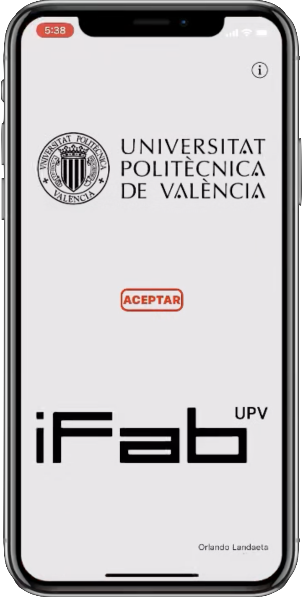
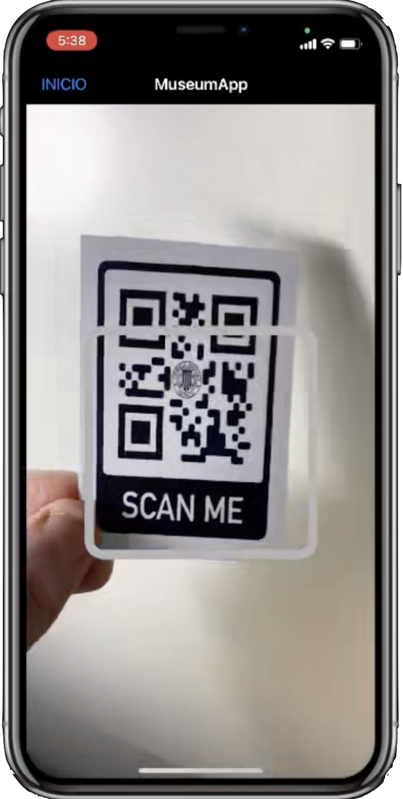
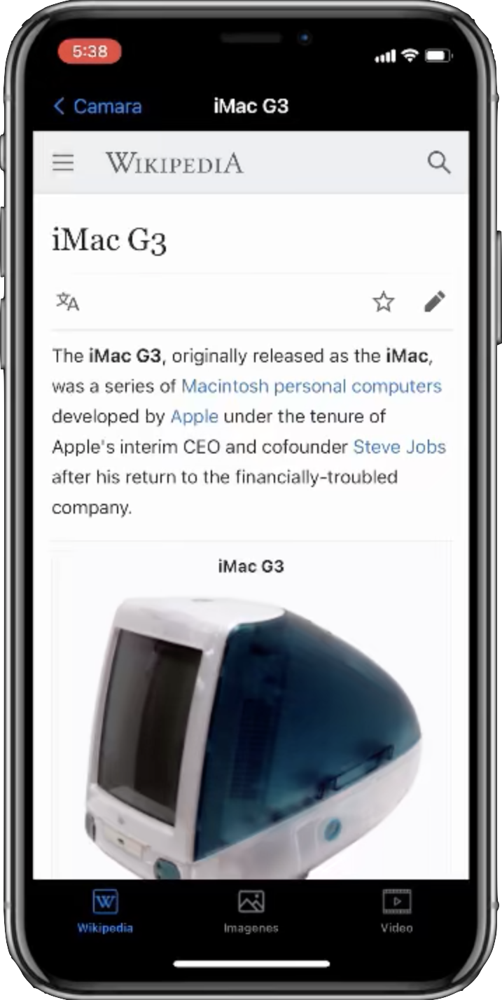
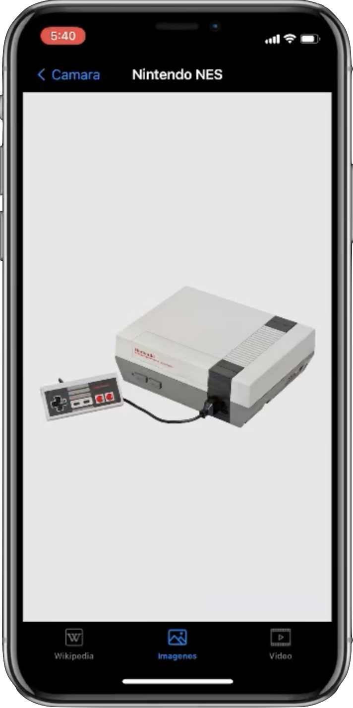
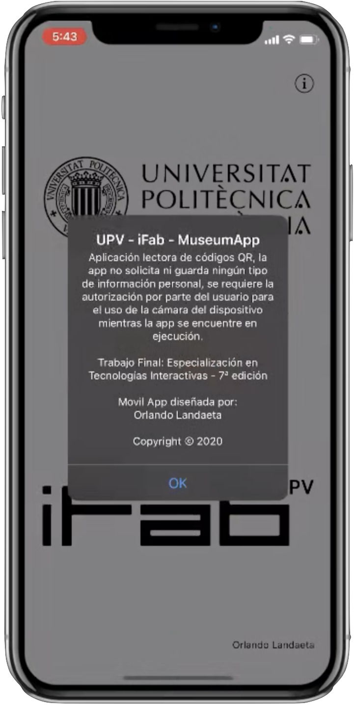
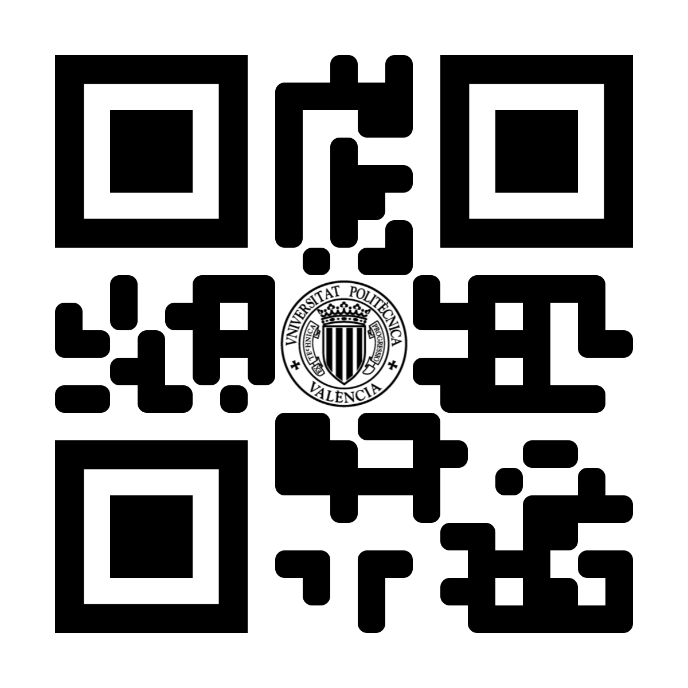
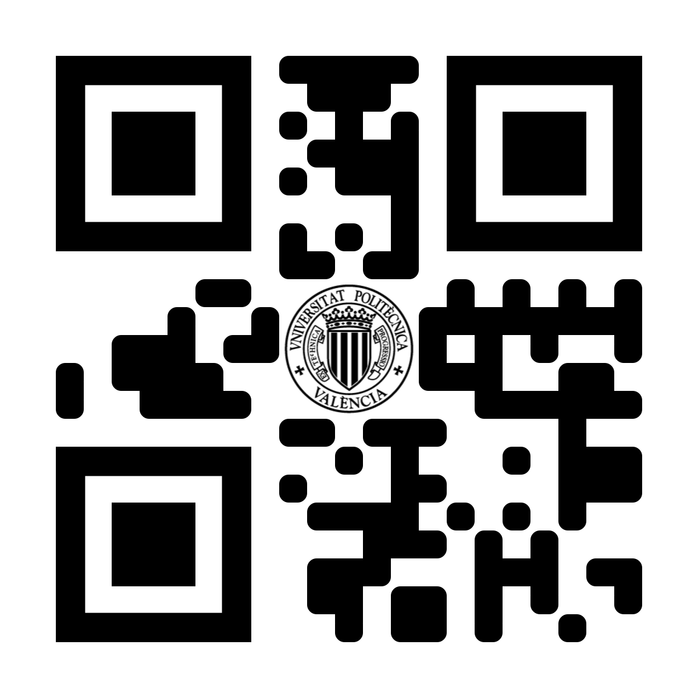
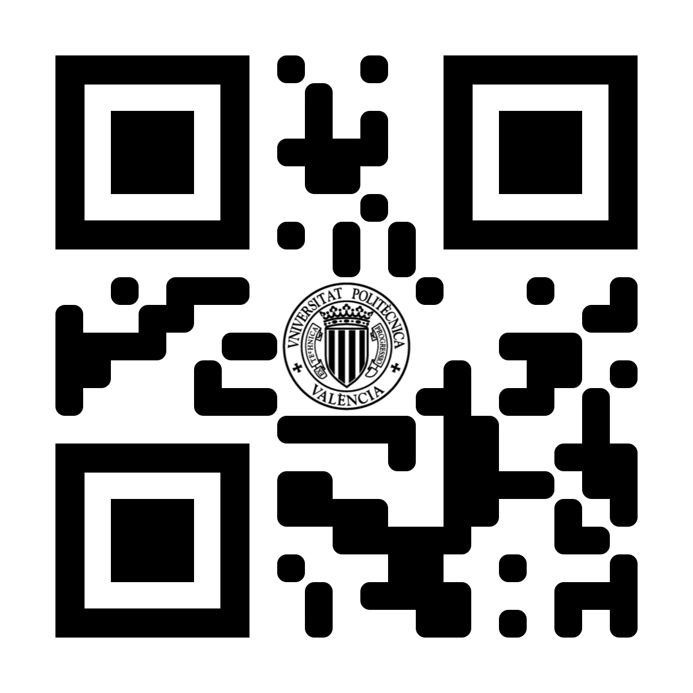
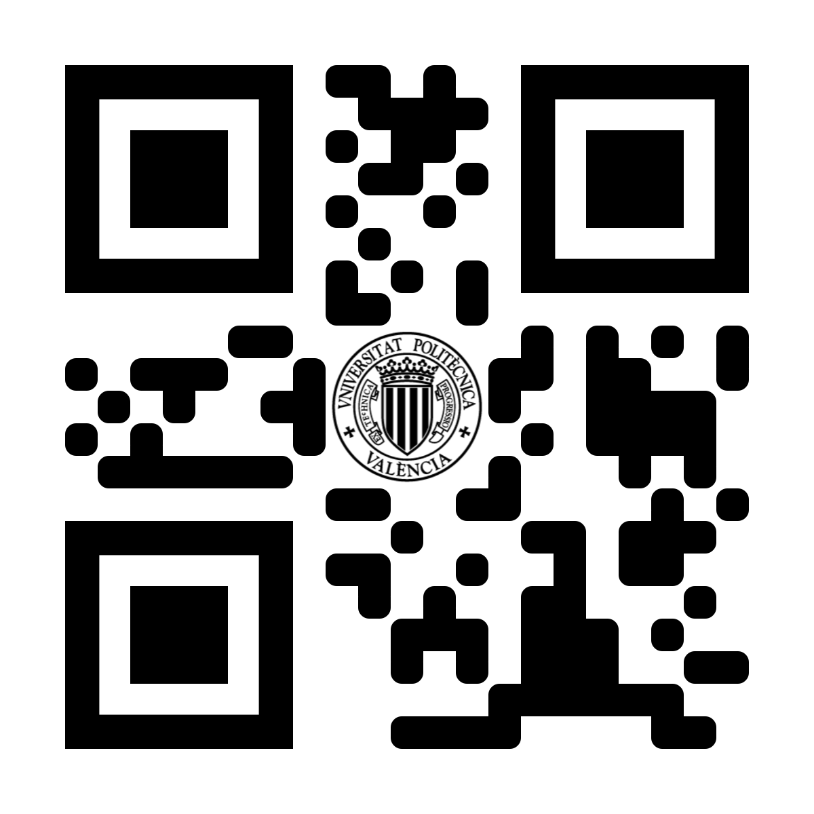

# README.MD

## Content

Este proyecto fue mi trabajo final para la Especialización en Tecnologías Interactivas en la U.P.V., se trata se una app que se encarga de leer códigos QR’s, con el dato obtenido realiza una búsqueda en un archivo JSON donde se encuentran las direcciones web del contenido a mostrar.

## Screenshots

  &nbsp;&nbsp;&nbsp;&nbsp;&nbsp;&nbsp;&nbsp;&nbsp;&nbsp;&nbsp;&nbsp;&nbsp;&nbsp;
  &nbsp;&nbsp;&nbsp;&nbsp;&nbsp;&nbsp;&nbsp;&nbsp;&nbsp;&nbsp;&nbsp;&nbsp;&nbsp;
   
  &nbsp;&nbsp;
  &nbsp;&nbsp;
  

## Installation
Si deseas probar la app, puedes descargar el codigo y probarla desde tu iPhone, se recomienda iOS 13 en adelante.

## Codigos QR

Con los codigos QR que se encuentran a continuacion podras probar la app.

  &nbsp;&nbsp;&nbsp;&nbsp;&nbsp;
     
  &nbsp;&nbsp;&nbsp;&nbsp;&nbsp;
  

